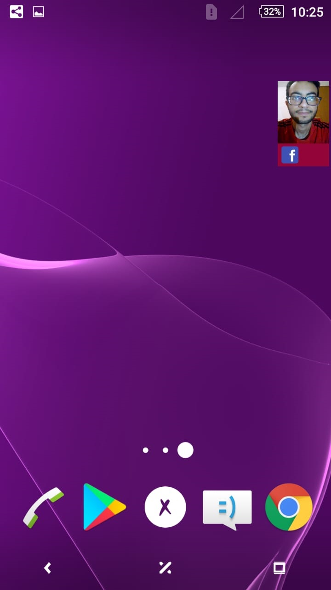
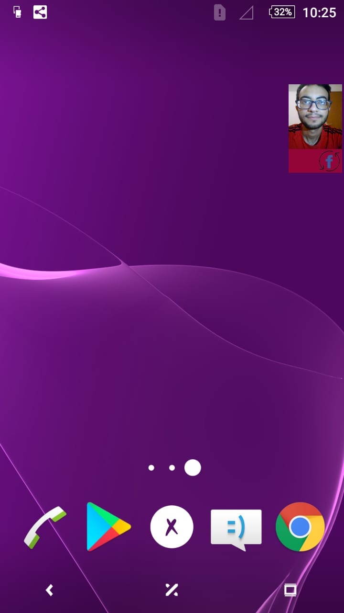

# Privacy Nudge - Camera Preview

For research purposes (my bachelor thesis), we wanted to investigate users' feelings and reaction regarding Apps that use front-facing camera. I designed 3 different mock-up feedback tools to inform/notify users that their front camera is accessed in real time.

This tool is about showing a floating window covering a small part of the screen which contains the front-facing camera feed. Moreover, Apps icons which are accessing the camera are showen at the bottom of the floating window.

## Screenshots

